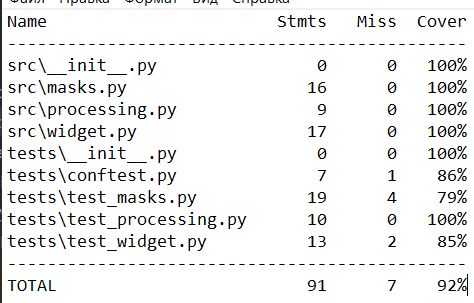

# Функционал для работы с данными клиента
## Цель: подготовка данных для отображения в новом виджете

## Установка

1. Клонируйте репозиторий:
```
git clone https://github.com/username/project-x.git
```
2. Установите зависимости:
```
pip install -r requirements.txt
```
## Содержание:

* Функция маскировки номера банковской карты 
get_mask_card_number

            Пример работы функции:
    * 7000792289606361     # входной аргумент
    * 7000 79** **** 6361  # выход функции


* Функция маскировки номера банковского счета 
`get_mask_account` 

             Пример работы функции:
    * 7000792289606361     # входной аргумент
    * 7000 79** **** 6361  # выход функции

* функция обрабатывает информацию как о картах, так и о счетах
`mask_account_card`
   
             Пример работы функции:
   Пример для карты:
    * Visa Platinum 7000792289606361  # входной аргумент
    * Visa Platinum 7000 79** **** 6361  # выход функции

   Пример для счета
    * Счет 73654108430135874305  # входной аргумент
    * Счет **4305  # выход функции
  
* Функция сокращает запись даты `get_date`

            Пример работы функции:
    * "2024-03-11T02:26:18.671407" # входной аргумент
    * "11.03.2024" # выход функции

* Функция фильтрует данные по статусу `filter_by_state`

           Пример работы функции:
    *  Выход функции со статусом по умолчанию 'EXECUTED'
    [{'id': 41428829, 'state': 'EXECUTED', 'date': '2019-07-03T18:35:29.512364'}, 
     {'id': 939719570, 'state': 'EXECUTED', 'date': '2018-06-30T02:08:58.425572'}]
    *  Выход функции, если вторым аргументов передано 'CANCELED'
    [{'id': 594226727, 'state': 'CANCELED', 'date': '2018-09-12T21:27:25.241689'},
     {'id': 615064591, 'state': 'CANCELED', 'date': '2018-10-14T08:21:33.419441'}]


* Функция сортирует данные по дате `sort_by_date`
   
         Пример работы функции:
     *  Выход функции (сортировка по убыванию, т. е. сначала самые последние операции)
  
     [{'id': 41428829, 'state': 'EXECUTED', 'date': '2019-07-03T18:35:29.512364'},
      {'id': 615064591, 'state': 'CANCELED', 'date': '2018-10-14T08:21:33.419441'},
      {'id': 594226727, 'state': 'CANCELED', 'date': '2018-09-12T21:27:25.241689'},
      {'id': 939719570, 'state': 'EXECUTED', 'date': '2018-06-30T02:08:58.425572'}]


* Функция фильтра данных по видам валюты `filter_by_currency`
            
       Пример работы функции

    * Фильтр данных по значению "USD"
[
        {
            "id": 939719570,
            "state": "EXECUTED",
            "date": "2018-06-30T02:08:58.425572",
            "operationAmount": {
                "amount": "9824.07",
                "currency": {"name": "USD", "code": "USD"},
            },
            "description": "Перевод организации",
            "from": "Счет 75106830613657916952",
            "to": "Счет 11776614605963066702",
        },
        {
            "id": 142264268,
            "state": "EXECUTED",
            "date": "2019-04-04T23:20:05.206878",
            "operationAmount": {
                "amount": "79114.93",
                "currency": {"name": "USD", "code": "USD"},
            },
            "description": "Перевод со счета на счет",
            "from": "Счет 19708645243227258542",
            "to": "Счет 75651667383060284188",
        },
        {
            "id": 895315941,
            "state": "EXECUTED",
            "date": "2018-08-19T04:27:37.904916",
            "operationAmount": {
                "amount": "56883.54",
                "currency": {"name": "USD", "code": "USD"},
            },
            "description": "Перевод с карты на карту",
            "from": "Visa Classic 6831982476737658",
            "to": "Visa Platinum 8990922113665229",
        },
    ]


Язык разработки: Python 3.13.7


# Code coverage




